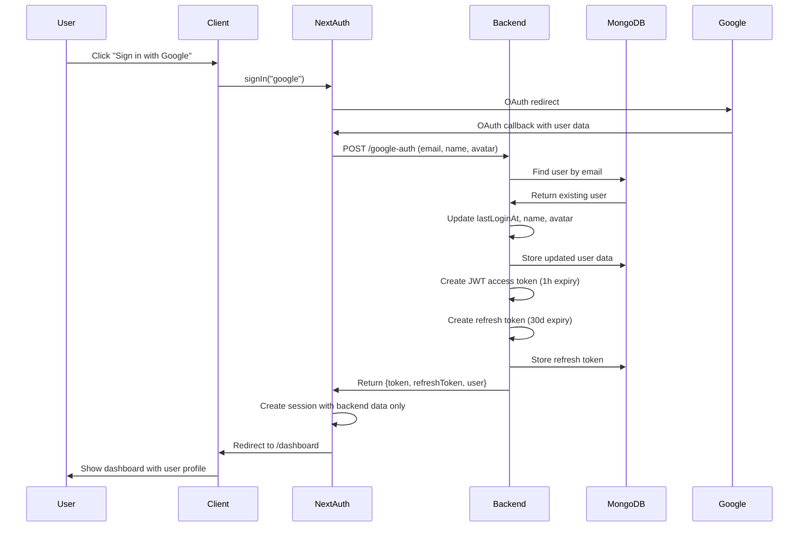
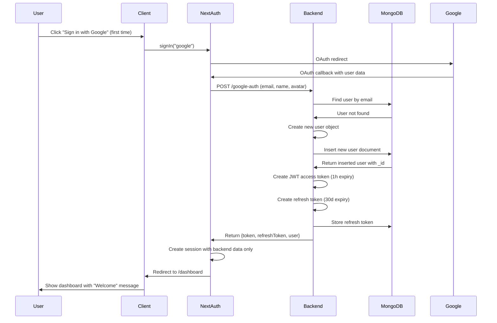
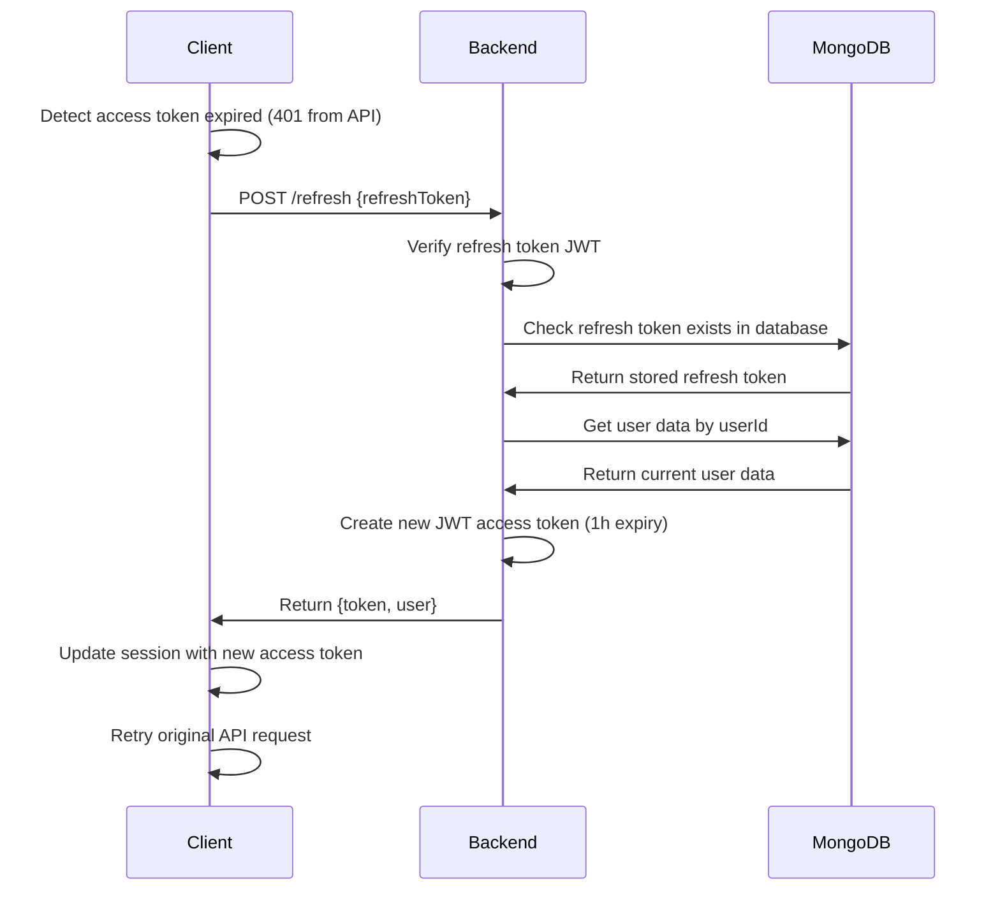
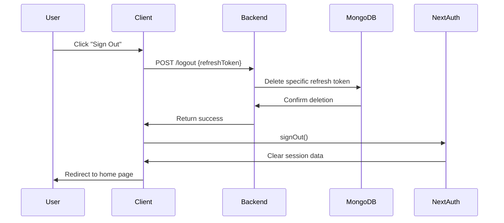
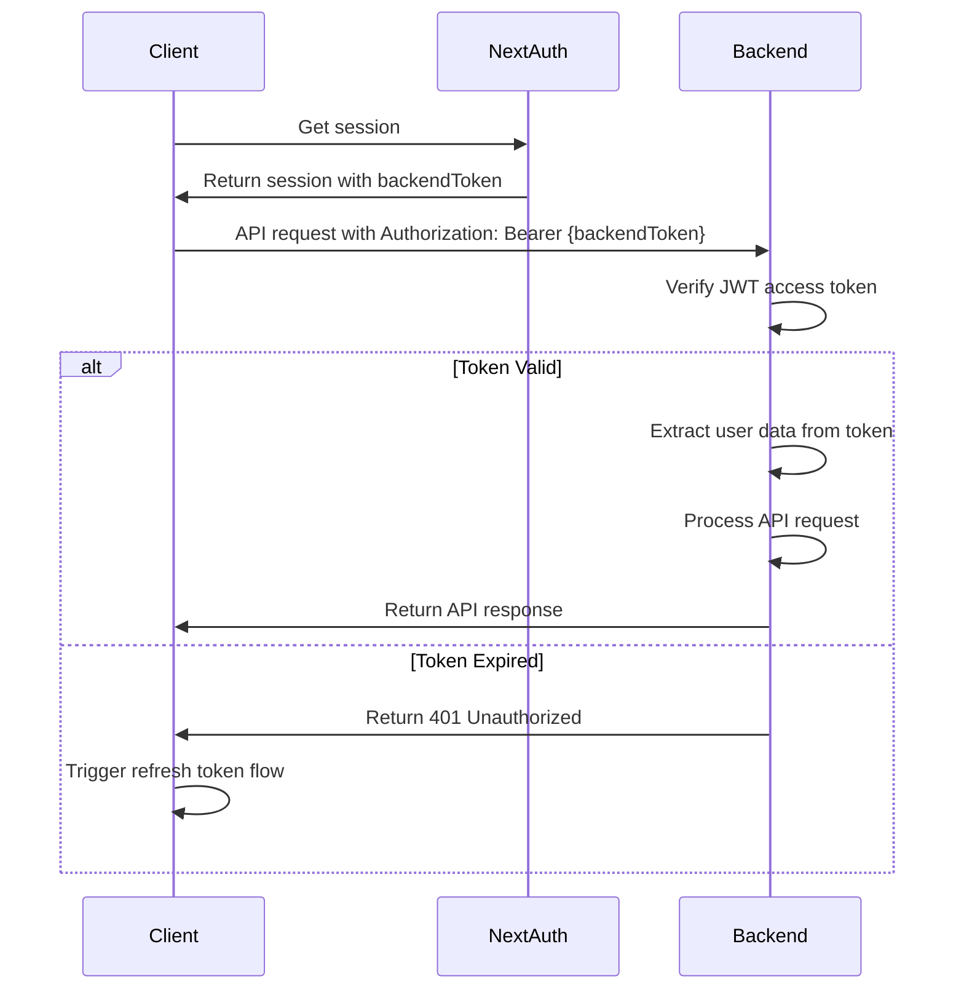

# SyntaxMem Authentication Flow

**Simple, Uniform, Consistent** authentication system using NextAuth.js + Python backend.

**Status**: ✅ **PRODUCTION READY** - Complete authentication system with full test coverage  
**Last Updated**: 2025-07-29  
**Features**: Login, Registration, Token Refresh, Logout, Logout All Devices, Session Management

This document outlines the complete authentication flow for SyntaxMem, covering all implemented authentication features with current production-ready implementation details.

## 🔐 Login Flow (Existing User)

### Step-by-Step Process



### Key Points
- **Existing user found** by `email` in database ✅
- **Profile updated** only if data actually changed ✅
- **Token cleanup** removes expired tokens automatically ✅
- **Session limits** enforced (2 tokens maximum) ✅
- **Schema validation** ensures data integrity ✅

---

## 👤 Register Flow (New User)

### Step-by-Step Process



### Key Points
- **New user created** when `email` not found ✅
- **Schema validation** ensures proper user creation ✅
- **Default role** assigned (`"user"`) ✅
- **Timestamps set** (createdAt, updatedAt, lastLoginAt) ✅
- **Same token flow** as existing user ✅

---

## 🔄 Token Refresh Flow

### Step-by-Step Process



### Key Points
- **Refresh tokens stored** in database for revocation ✅
- **Global token cleanup** removes expired tokens ✅
- **User data refreshed** from database (role changes, etc.) ✅
- **New access token** issued with latest user data ✅
- **Session updated** with new token and user data ✅

---

## 🚪 Logout Flow

### Step-by-Step Process



### Key Points
- **Backend called first** to revoke refresh token ✅
- **Database cleanup** prevents token reuse ✅
- **NextAuth clears** session after backend cleanup ✅
- **Graceful fallback** - still logs out if backend fails ✅
- **Loading states** provide user feedback ✅

---

## 🔒 API Request Flow (Protected Routes)

### Step-by-Step Process



### Key Points
- **Session contains** `backendToken` for API requests ✅
- **JWT verification** on every protected endpoint ✅
- **Schema validation** ensures request data integrity ✅
- **User context** extracted from valid tokens ✅
- **Automatic refresh** triggered on 401 errors ✅

---

## 🛡️ Security Principles

### Backend-Driven Authentication
- **No standalone client sessions** - backend must validate all auth
- **Database storage required** - users and refresh tokens persisted
- **JWT contains user context** - role, permissions embedded
- **Refresh tokens revocable** - stored in database for security

### Token Strategy
- **Short-lived access tokens** (1 hour) - minimize exposure
- **Long-lived refresh tokens** (30 days) - reduce login frequency  
- **Refresh tokens stored** - enable revocation and session management
- **JWT secrets secure** - environment variable only

### Flow Consistency
- **Same endpoints** for login and register - backend determines flow
- **Uniform responses** - consistent error handling and data format
- **NextAuth integration** - session mechanics handled by framework
- **Simple client logic** - complex auth handled server-side

---

## 🔧 Environment Configuration

### Client (.env.local)
```bash
NEXTAUTH_URL=http://localhost:3000
NEXTAUTH_SECRET=your-secret-key
GOOGLE_CLIENT_ID=your-google-client-id
GOOGLE_CLIENT_SECRET=your-google-client-secret
NEXT_PUBLIC_AUTH_API_URL=http://localhost:8081
```

### Server (.env)
```bash
MONGODB_URI=your-mongodb-connection-string
DATABASE_NAME=syntaxmem
JWT_SECRET=your-jwt-secret-minimum-32-chars
GOOGLE_CLIENT_ID=your-google-client-id
GOOGLE_CLIENT_SECRET=your-google-client-secret
CORS_ORIGINS=http://localhost:3000
```

---

**Remember**: Simple ≠ "not good". Simple = elegant, secure, maintainable authentication flows that scale with your application needs.