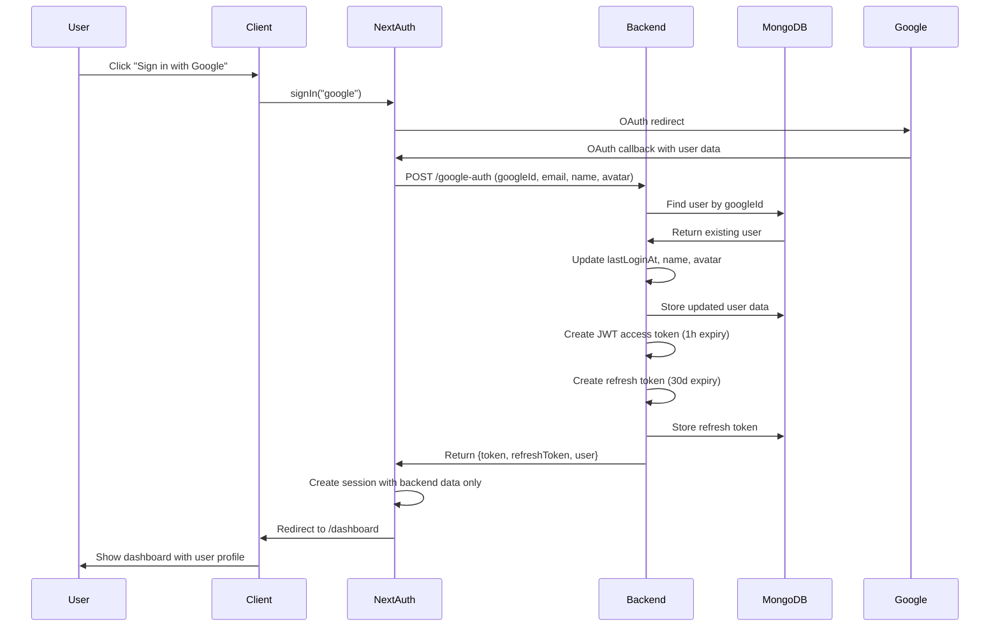
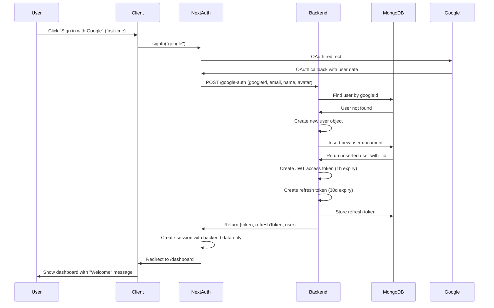
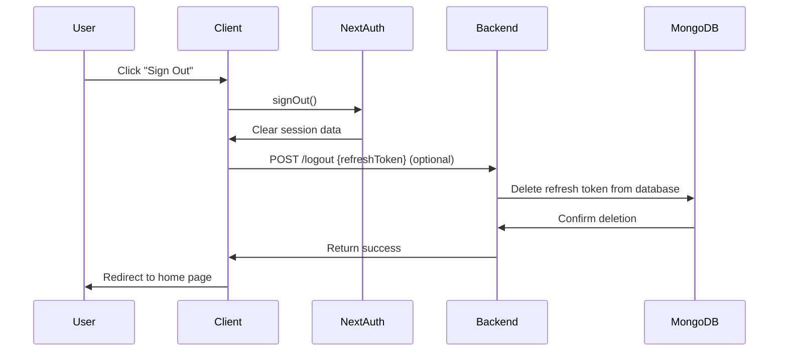

# SyntaxMem - Authentication Flow Documentation

**Simple, Uniform, Consistent** authentication flows for all user operations.

## 🔐 Login Flow (Existing User)

### Step-by-Step Process



### Key Points
- **Existing user found** by `googleId` in database
- **Profile updated** with latest Google data
- **Login timestamp** recorded
- **New tokens issued** for this session
- **NextAuth session** populated with backend data only

---

## 👤 Register Flow (New User)

### Step-by-Step Process



### Key Points
- **New user created** when `googleId` not found
- **Default role** assigned (`"user"`)
- **Timestamps set** (createdAt, updatedAt, lastLoginAt)
- **Same token flow** as existing user
- **Identical session creation** - no difference client-side

---

## 🔄 Token Refresh Flow

### Step-by-Step Process


### Key Points
- **Refresh tokens stored** in database for revocation
- **User data refreshed** from database (role changes, etc.)
- **New access token** issued with latest user data
- **Refresh token remains** valid until 30-day expiry
- **Session updated** with new token and user data

---

## 🚪 Logout Flow

### Step-by-Step Process



### Key Points
- **NextAuth clears** session immediately
- **Optional backend call** to revoke refresh token
- **Database cleanup** prevents token reuse
- **Simple redirect** to public pages

---

## 🔒 API Request Flow (Protected Routes)

### Step-by-Step Process


### Key Points
- **Session contains** `backendToken` for API requests
- **JWT verification** on every protected endpoint
- **User context** extracted from valid tokens
- **Automatic refresh** triggered on 401 errors

---

## 🛡️ Security Principles

### Backend-Driven Authentication
- **No standalone client sessions** - backend must validate all auth
- **Database storage required** - users and refresh tokens persisted
- **JWT contains user context** - role, permissions embedded
- **Refresh tokens revocable** - stored in database for security

### Token Strategy
- **Short-lived access tokens** (1 hour) - minimize exposure
- **Long-lived refresh tokens** (30 days) - reduce login frequency  
- **Refresh tokens stored** - enable revocation and session management
- **JWT secrets secure** - environment variable only

### Flow Consistency
- **Same endpoints** for login and register - backend determines flow
- **Uniform responses** - consistent error handling and data format
- **NextAuth integration** - session mechanics handled by framework
- **Simple client logic** - complex auth handled server-side

---

## 🔧 Environment Configuration

### Client (.env.local)
```bash
NEXTAUTH_URL=http://localhost:3000
NEXTAUTH_SECRET=your-secret-key
GOOGLE_CLIENT_ID=your-google-client-id
GOOGLE_CLIENT_SECRET=your-google-client-secret
NEXT_PUBLIC_AUTH_API_URL=http://localhost:8081
```

### Server (.env)
```bash
MONGODB_URI=your-mongodb-connection-string
DATABASE_NAME=syntaxmem
JWT_SECRET=your-jwt-secret-minimum-32-chars
GOOGLE_CLIENT_ID=your-google-client-id
GOOGLE_CLIENT_SECRET=your-google-client-secret
CORS_ORIGINS=http://localhost:3000
```

---

**Remember**: Simple ≠ "not good". Simple = elegant, secure, maintainable authentication flows that scale with your application needs.